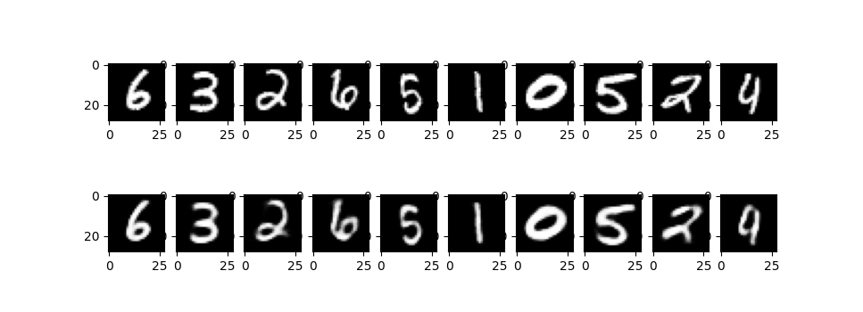
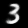
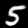
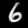
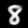

# Basic Autoencoder

This project provides an impementation of a rudimentary _autoencoder_ with Tensorflow. Autoencoders are neural networks used to reproduce given input data in a two-step process. First they compress the input to a reduced reprensentation (_encoding layer_). In the second step the original data is recreated from this representation (_decoding layer_).\
This autoencoder is desingned to reproduce images from the Mnist dataset. All input and output images are greyscaled with a size of 28 x 28 pixels. Furthermore it can generate own images by providing randomized input data to the decoding layer.

## Examples
* Comparison of the orginal Mnist images (top) with the reproduced images from the autoencoder: 


* Sample of generated images from random input data:
\
    

## Setup and Usage
1. (Optional) Create a virtual python environment:
```
$ virtualenv env
$ source env/bin/activate
``` 

2. Install neccessary libraries:
```
$ pip install -r requirements.txt
```

3. Run program or perform a validation test:
``` 
python main.py 
```
```
python test.py
``` 

## TODOs:
* Add more training data sources (e.g. Quickdraw, custom user images etc.)
* Use convolutional and pooling layers instead of dense layers in model configuration